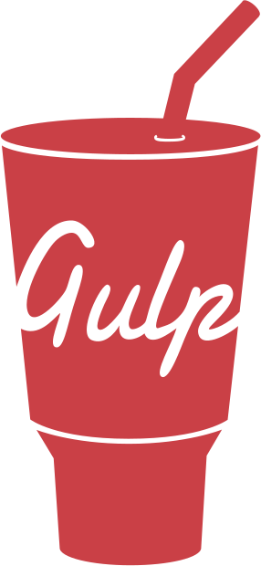

# Hi 👋, I'm Sohit Mishra

I'm a passionate full-stack web developer with expertise in **HTML, CSS, JavaScript, Node.js, React.js**, and more.

🔭 I’m currently working on MERN Stack Projects.

🌱 I’m currently learning Mern Stack developer.

💬 Ask me about Frontend development, Backend development.

Let's connect and explore my projects on GitHub. Reach out at [7836020160s@gmail.com](mailto:7836020160s@gmail.com).

## 🖥️ Language and tools 🖥️

## 🤝Let's Connect

